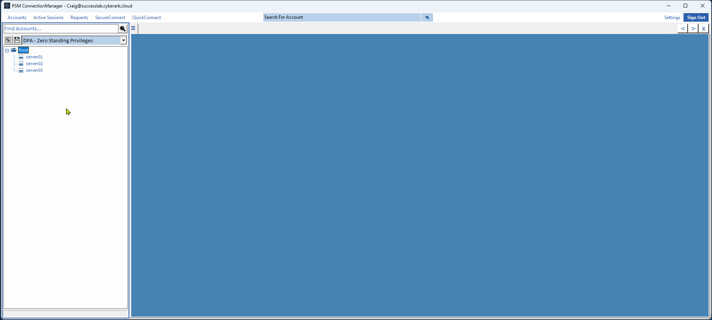

# CyberArk PSMClient RDG Importer Utility
An interactive tool for importing [Sysinternals Remote Desktop Connection Manager (RDCMan)](https://learn.microsoft.com/en-us/sysinternals/downloads/rdcman) RDG files, into the [PSMClient (Connection Manager)](https://community.cyberark.com/marketplace/s/#a352J000000eEyfQAE-a392J000002lgUDQAY) client's RDP CustomView.

With the addition of the RDP CustomView to the CyberArk PSMClient Connection Manager, it is now possible to create an organized tree of grouped server entries akin to most popular RDP connection managers available today.  Windows administrators that were previously leveraging Sysinternals Remote Desktop Connection Manager (RDCMan) with an established set of predefined RDG / Group / Server tree(s), can leverage this script to import these trees quickly and easily into PSMClient Connection Manager's RDP CustomView.

>**Note**: This solution is provided as-is, it is not supported by CyberArk nor an official CyberArk solution

## Features
- Interactive design and no administrative rights required.  Simply right-click and "Run with PowerShell"
- Creates a backup of existing PSMClient RDP CustomView (Custom.xml) to easily rollback changes
- Supports simultaneous import of multiple Remote Desktop Manager (RDCMan) Group files (*.rdg)
- Respects existing anchor points by the same name in PSMClient CustomView and will avoid clobbering

# How to Use
1. Download the latest version of ``CyberArk_PSMClient_Importer.ps1`` from [Releases](https://github.com/cgeneske/CyberArkPSMClientImporter/releases)
2. Right-Click ``CyberArk_PSMClient_Importer.ps1`` and select "Run with PowerShell"
3. When prompted, browse to and open the one or more ``.rdg`` files you would like to import into PSMClient Connection Manager
4. When prompted, browse to and open ``PSMConnectionManager.exe``, located wherever you've extracted the PSMClient package
5. Open PSMClient Connection Manager and switch to ``Accounts > RDP CustomView`` or refresh this view (if already open)
6. Enjoy!

# Support
This project is neither developed nor supported by CyberArk; any official support channels offered by the vendor are not appropriate for seeking help with the implementation or function of this solution.

Help and support should be sought by [opening an issue][new-issue].

[new-issue]: https://github.com/cgeneske/CyberArkPSMClientImporter/issues/new

# License
This project is [licensed under the MIT License](LICENSE.md).